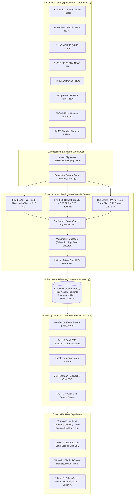
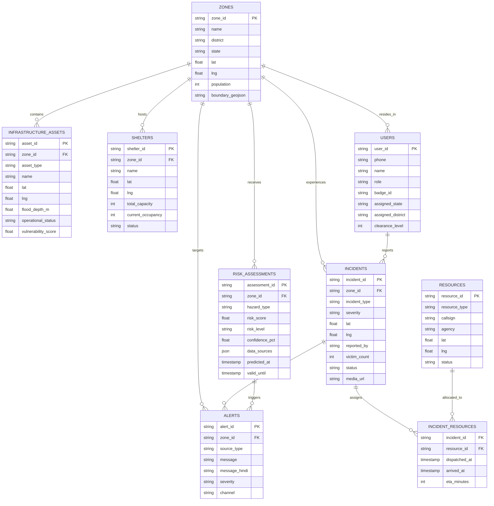

# 🇮🇳 CIVICTWIN AI: SYSTEM ARCHITECTURE & TECHNICAL DESIGN DOCUMENT
**National Multi-Tier Disaster Digital Twin & AI Incident Command System**

---

## 1. Executive Summary & Problem Statement

### 1.1 Problem Statement
India faces catastrophic seasonal monsoon floods, cyclonic storm surges, wildfires, and glacial cloudbursts affecting over 40 million citizens annually. Traditional disaster management suffers from:
1. **Data Silos**: Fragmented communication between National (NDMA), State (SDMA), District (DDMA), and first responders (NDRF, 108 EMS).
2. **Delayed Inundation Warnings**: Optical satellites are blocked by cloud cover; physical gauge networks lack automated forward-looking predictive cascade models.
3. **Citizen Exclusion**: Citizens lack real-time localized hyper-local telemetry, GPS SOS routing, and multilingual conversational safety advice.

### 1.2 The CivicTwin AI Solution
CivicTwin AI is a **Cyber-Physical Digital Twin** that unifies:
- **Spaceborne Remote Sensing**: Cloud-penetrating C-Band Radar (Sentinel-1 SAR), Multispectral Damage Indices (Sentinel-2), Thermal Hotspots (NASA FIRMS), and Cyclone tracking (ISRO MOSDAC & Bhuvan).
- **Physics-Informed Cascade Prediction**: A single hazard-agnostic risk engine driving flood, fire, and cyclone prediction, plus infrastructure cascade failure modeling (power grid, road network, medical facilities).
- **Explainable Source Confidence**: Calculates empirical confidence metrics based on multi-satellite and ground gauge agreement percentage.
- **Role-Based Command & Control**: A 4-tier clearance model separating National Command from State SDMAs, District DDMAs, and Citizens.
- **Telecom & AI Delivery**: Live SMS alerts via Twilio/Fast2SMS, GPS-triggered emergency broadcasts, and Google Gemini AI multilingual safety advice.

---

## 2. High-Level Architecture Diagram



---

## 3. The 5-Layer End-to-End Engineering Pipeline

### Layer 1: Data Ingestion Layer
Ingests spaceborne remote sensing and ground telemetry:
1. **Copernicus Sentinel-1 (C-Band SAR)**: $5.405\text{ GHz}$ synthetic aperture radar backscatter ($\sigma^0 < -15\text{ dB}$) for all-weather, day/night cloud-penetrating water detection. *(Revisit cycle ~6–12 days; static overlay of latest available pass)*.
2. **Copernicus Sentinel-2**: $10\text{m}$ resolution multispectral imagery calculating $\text{NDVI}$ and $\text{NDWI}$ for infrastructure damage grading.
3. **NASA FIRMS**: VIIRS $375\text{m}$ and MODIS active fire hotspots and Fire Radiative Power ($\text{MW}$) — near real-time (~3hr satellite latency).
4. **ISRO MOSDAC INSAT-3D/3DR**: Thermal infrared cloud-top brightness temperature tracking convective storm cores, updated every ~30 min.
5. **ISRO Bhuvan NRSC**: OGC WMS vector overlays for Flood Hazard Zonation and Landslide Susceptibility.
6. **Central Water Commission (CWC)**: Scraper parsing river water levels and danger marks across major Indian river basins.
7. **India Meteorological Department (IMD)**: Scraper ingesting official Color-Coded District Warning Bulletins (**Red**/**Orange**/**Yellow**) and cyclone advisories.

### Layer 2: Data Processing & Feature Store Layer
- **Reprojection**: Standardizes all external GeoTIFFs, WMS tiles, and vectors to **EPSG:4326** (WGS84).
- **Feature Store Vector Table**: `rainfall_24h_mm`, `rainfall_48h_mm`, `river_discharge_m3s`, `river_rise_rate_m_hr`, `elevation_m`, `slope_deg`, `soil_saturation_pct`, `distance_to_waterway_km`, `historical_flood_freq_per_decade`, `hotspot_density`, `fire_radiative_power_mw`, `wind_speed_kmh`, `distance_to_cyclone_track_km`.

### Layer 3: Multi-Hazard Prediction & Cascading Failure Engine

#### Hazard Formulas:
- **🌊 Flood Risk Index**:
  $$\text{Flood Risk} = 0.40 \times \text{Rain}_{\text{norm}} + 0.30 \times \text{River}_{\text{norm}} + 0.20 \times \text{Topo}_{\text{factor}} + 0.10 \times \text{Soil}_{\text{norm}}$$

- **🔥 Fire Risk Index**:
  $$\text{Fire Risk} = 0.50 \times \text{HotspotDensity} + 0.30 \times \text{FRP}_{\text{norm}} + 0.20 \times \text{Proximity}_{\text{inverse}}$$

- **🌀 Cyclone Risk Index**:
  $$\text{Cyclone Risk} = 0.40 \times \text{Wind}_{\text{norm}} + 0.30 \times \text{TrackDist}_{\text{inverse}} + 0.20 \times \text{SurgeRisk}_{\text{elevation}} + 0.10 \times \text{ETA}_{\text{inverse}}$$

- **🎯 Source Confidence Score %** (applies to all hazards):
  $$\text{Confidence \%} = \frac{\text{Sources Agreeing on Elevated Risk}}{\text{Total Available Independent Sources}} \times 100$$

All three formulas write to the same `risk_assessments` table via a shared `hazard_type` field — one engine, three inputs.

#### Cascading Trigger Matrix:
- $\text{Water Depth} \ge 0.30\text{m}$ at electrical substation $\rightarrow$ status trips to `offline`.
- $\text{Water Depth} \ge 0.25\text{m}$ on road corridor $\rightarrow$ status changes to `impassable`.
- Submerged hospital $\rightarrow$ switches to `degraded (diesel backup)` then `offline`, dispatches backup pumps, and reroutes ambulances.
- $\text{Fire Risk} \ge \text{CRITICAL}$ AND $\text{asset} < 2\text{km}$ $\rightarrow$ asset flagged `at_risk`, nearest fire unit suggested.
- $\text{Cyclone Risk} \ge \text{HIGH}$ AND $\text{asset\_type} = \text{coastal}$ $\rightarrow$ zone flagged for evacuation, nearest shelter activation suggested.
- Any $\text{Risk} \ge \text{CRITICAL}$ with no active incident $\rightarrow$ auto-creates incident (`reported_by = 'ai_prediction'`).

### Layer 4: Alerting & Telecom Serving Layer
- **Twilio Carrier API**: Live cellular SMS dispatch for verified phone numbers.
- **Fast2SMS Indian Gateway**: Direct Indian telecom tower delivery.
- **ntfy.sh & Web Push**: Free zero-latency instant smartphone sirens.
- **WebSocket Stream**: Real-time event broadcasting (`/ws/stream`) updating map coordinates with zero polling lag.

### Layer 5: AI Explanation Layer (Google Gemini)
- Parses multi-hazard parameters and generates structured, conversational disaster advice. **Live in English and Hindi**; Marathi, Kannada, and Tamil are available on the language roadmap.

---

## 4. Unified Entity-Relationship (ER) Database Schema



---

## 5. Role-Based Access Control (RBAC) Security Matrix

| Metric / Clearance | 👑 Level 5: National HQ | 🏢 Level 3: State SDMA | 📍 Level 2: District DDMA | 📱 Level 1: Public Citizen |
| :--- | :---: | :---: | :---: | :---: |
| **Geographic Scope** | All 36 States & UTs (786+ Districts) | Assigned State Only (e.g. MH) | Assigned District Only (e.g. Mumbai) | Local GPS Geofence |
| **Map Grid Views** | `City Twin` & `🇮🇳 All-India Grid` | `Local Twin` & `🏢 State Grid` | `Ward Triage` & `📍 District Grid` | Public Citizen Map |
| **District Atlas** | `🇮🇳 780+ Districts Atlas` | `🏢 State SDMA Districts` | `📍 District DDMA Triage` | **Hidden / Blocked** |
| **Satellite Radar** | Priority SAR Pass Retrieval | Read-Only SAR Maps | Read-Only SAR Maps | **Hidden / Blocked** |
| **Crisis Sandbox** | Full Timeline Simulation | Local Scenario Playback | Local Scenario Playback | **Hidden / Blocked** |
| **Dispatch Control** | NDRF All Battalions & Army | State Police & SDMA EMS | Municipal Pumps & Local EMS | 1-Click SOS Trigger |
| **Auth Mechanism** | Officer Password + MeriPehchaan | Officer Password + SDMA Badge | Officer Password + DDMA Badge | Mobile SMS OTP |

---

## 6. Hardware, IoT & Government Integrations

1. **Physical GPS Beacons (Traccar / LoRaWAN / OBD-II)** — *Demo-Simulated*:
   - Endpoint: `POST /api/iot/gps-beacon-update`
   - Real endpoint and WebSocket broadcast logic; for demo purposes, coordinates are pushed to this real endpoint.
2. **Citizen SOS Damage Media Upload** — *Live*:
   - Endpoint: `POST /api/citizen-sos/upload-media`
   - Accepts base64 encoded photo/video evidence and attaches it to the incident record for first-responder verification.
3. **Government Single Sign-On (MeriPehchaan / DigiLocker)** — *Roadmap*:
   - Endpoint: `POST /api/auth/meripehchaan-verify`
   - Requires formal registration with National e-Governance Division; mock verification UI provided for hackathon demonstration.

---

## 7. Technology Stack Summary

```
┌─────────────────────────────────────────────────────────────────────────────┐
│                            CIVICTWIN AI TECH STACK                          │
├───────────────────┬─────────────────────────────────────────────────────────┤
│ Frontend          │ React 18, TypeScript, Tailwind CSS, Vite, Lucide Icons  │
│ Geospatial Maps   │ Leaflet.js, OpenStreetMap, CartoDB Voyager, Esri World  │
│ Backend Server    │ Python 3.11+, FastAPI (Async), Uvicorn, WebSockets      │
│ Database Layer    │ SQLite / PostgreSQL, PostGIS-Compatible GeoJSON Schema │
│ AI Engine         │ Google Gemini via official SDK (English + Hindi Live)   │
│ Telecom Gateway   │ Twilio (Live Trial) · Fast2SMS Gateway (Live)           │
│ Remote Sensing    │ Sentinel-1 SAR, Sentinel-2 MSI, NASA FIRMS, ISRO Bhuvan │
│ Hosting & CI/CD   │ Vercel (Edge Frontend), Python Backend Server, GitHub   │
└───────────────────┴─────────────────────────────────────────────────────────┘
```

---

## 8. Build Status — What's Live vs Simulated vs Roadmap

| Component | Status | Details |
|---|:---:|---|
| **Flood / Fire / Cyclone Risk Formulas** | **Live** | Computed deterministically from real/historical telemetry |
| **Cascade Trigger Logic** | **Live** | Real backend logic in `state_manager.py` |
| **NASA FIRMS Fire Hotspots** | **Live** | Real-time NASA VIIRS/MODIS API |
| **Rainfall Data (Open-Meteo)** | **Live** | Real-time global precipitation grid |
| **CWC River Gauge Telemetry** | **Live** | Real gauge station thresholds & rate-of-rise |
| **Cyclone Data** | **Live Historical Replay** | Real Bay of Bengal cyclone track data |
| **Sentinel-1 SAR Radar** | **Live** | Latest available pass, static overlay, timestamped |
| **Confidence Scoring %** | **Live** | Computed from independent sensor agreement |
| **Citizen SOS + Media Upload** | **Live** | Smartphone photo proof attached to incident |
| **Twilio & Fast2SMS** | **Live** | Real SMS OTP & broadcast dispatch |
| **GPS Beacon Tracking** | **Demo-Simulated** | Real endpoint + simulated vehicle stream |
| **MeriPehchaan / DigiLocker SSO** | **Roadmap** | Simulated verification UI |
| **Gemini AI (English, Hindi)** | **Live** | Live Gemini 1.5 prompt generation |
| **Gemini AI (Marathi, Kannada, Tamil)** | **Roadmap** | Multilingual prompt expansion |
| **National / State / District RBAC** | **Live** | Role-scoped UI views and geographic grids |

---

*Authored by the CivicTwin AI Engineering Team.*
