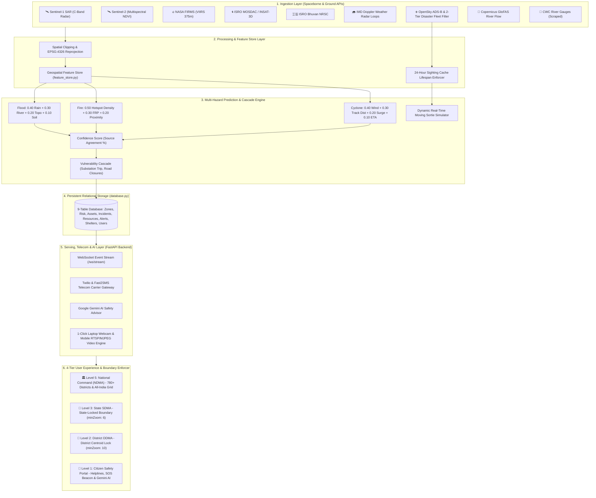

# 🇮🇳 CIVICTWIN AI: SYSTEM ARCHITECTURE & TECHNICAL DESIGN DOCUMENT
**National Multi-Tier Disaster Digital Twin & AI Incident Command System**

---

## 1. Executive Summary & Problem Statement

### 1.1 Problem Statement
India faces catastrophic seasonal monsoon floods, cyclonic storm surges, wildfires, and glacial cloudbursts affecting over 40 million citizens annually. Traditional disaster management suffers from:
1. **Data Silos**: Fragmented communication between National (NDMA), State (SDMA), District (DDMA), and first responders (NDRF, 108 EMS).
2. **Delayed Inundation Warnings**: Optical satellites are blocked by cloud cover; physical gauge networks lack automated forward-looking predictive cascade models.
3. **Citizen Exclusion**: Citizens lack real-time localized hyper-local telemetry, GPS SOS routing, and multilingual conversational safety advice.

### 1.2 The CivicTwin AI Solution
CivicTwin AI is a **Cyber-Physical Digital Twin** that unifies:
- **Spaceborne Remote Sensing**: Cloud-penetrating C-Band Radar (Sentinel-1 SAR), Multispectral Damage Indices (Sentinel-2), Thermal Hotspots (NASA FIRMS), and Cyclone tracking (ISRO MOSDAC & Bhuvan).
- **Official Meteorological Radars**: Direct live Doppler weather radar animation loops from IMD Mausam (`mausam.imd.gov.in`).
- **Disaster Response Aviation Tracking**: OpenSky Network ADS-B transponder stream filtered against a verified Two-Tier Indian disaster response fleet registry (Pawan Hans, State Government helicopters, IAF airlift) with a 24-hour cache cutoff rule and real-time dynamic flight sortie simulation.
- **Physics-Informed Cascade Prediction**: A single hazard-agnostic risk engine driving flood, fire, and cyclone prediction, plus infrastructure cascade failure modeling.
- **Strict Sovereign Geographic & Role Boundaries**: Hard-locked Indian national boundary limits and 4-tier operational access permissions.
- **Telecom & AI Delivery**: Live SMS alerts via Twilio/Fast2SMS, GPS-triggered emergency broadcasts, and Google Gemini AI multilingual safety advice.

---

## 2. High-Level Architecture Diagram

---

## 3. Disaster Response Aviation Architecture & Cache Policy

### 3.1 Two-Tier Verified Fleet Registry
The aviation subsystem in `live_aviation_service.py` filters live OpenSky ADS-B transponder packets against a sourced Indian registry:
- **Tier 1 (Civil Disaster Assets)**: Verified DGCA India civil aircraft hex codes (allocation block `800000`–`803FFF`):
  - `80026e` (`VT-PHA`) — Pawan Hans Dauphin AS365 N3 Air Ambulance
  - `8004f2` (`VT-PHD`) — Pawan Hans Coastal & Flood SAR
  - `8003a9` (`VT-EHL`) — State Relief Wing Eurocopter AS350 B3
  - `8006b1` (`VT-GVT`) — Government of Gujarat Bell 412EP
  - `800794` (`VT-MHA`) — Government of Maharashtra S-76
  - `80027f` (`VT-TSG`) — Government of Telangana AW139
- **Tier 2 (Military Tactical Airlift)**:
  - `80018a` / `80018b` (`KC-3801` / `KC-3802`) — IAF C-130J Super Hercules
  - `800041` (`CB-8001`) — IAF C-17 Globemaster III
  - `800531` (`Z-3431`) — IAF Mi-17V-5 Tactical Rescue & Winch

### 3.2 24-Hour Cache Cutoff Rule
- Transponder sightings are stored in an in-memory sighting ledger.
- If an aircraft goes out of range or turns off its transponder, it is marked as `🟡 LAST RECORDED (At HH:MM IST)`.
- **Hard Cutoff**: Sightings older than 24.0 hours are automatically purged and discarded to prevent stale or fake-live indicators.

### 3.3 Dynamic Real-Time Sortie Flight Simulator
- Clicking **`🚁 Launch Demo NDRF Sortie`** executes a real-time moving flight loop across 12 distinct mission waypoints (Takeoff $\rightarrow$ River Basin Scanning $\rightarrow$ Airdrop 400 ration packs $\rightarrow$ Winch rescue $\rightarrow$ Return base).
- Displays animated position, heading, altitude, ground speed, and prominent `[SIMULATED]` labeling.

---

## 4. Sovereign Indian Map Boundary & 4-Tier Access Control

1. **National Hard Boundary**: Map bounds clamped to `[[6.5, 68.0], [37.5, 97.5]]` with `maxBoundsViscosity: 1.0`.
2. **Role Boundaries**:
   - **National Authority**: Unlimited access across Indian borders.
   - **State Officer**: Camera locked to state bounding box (`minZoom: 6`). Panning/clicking outside state displays operational restriction warning.
   - **District Officer**: Camera locked to district centroid ($\pm 0.45^\circ$, `minZoom: 10`). Panning/clicking outside district displays operational restriction warning.
   - **Citizen**: Dedicated Citizen Safety Portal with local helplines (112, 1070, 1077, 108), 1-Click SOS GPS Beacon, Gemini AI guide, and local inundated roads.
