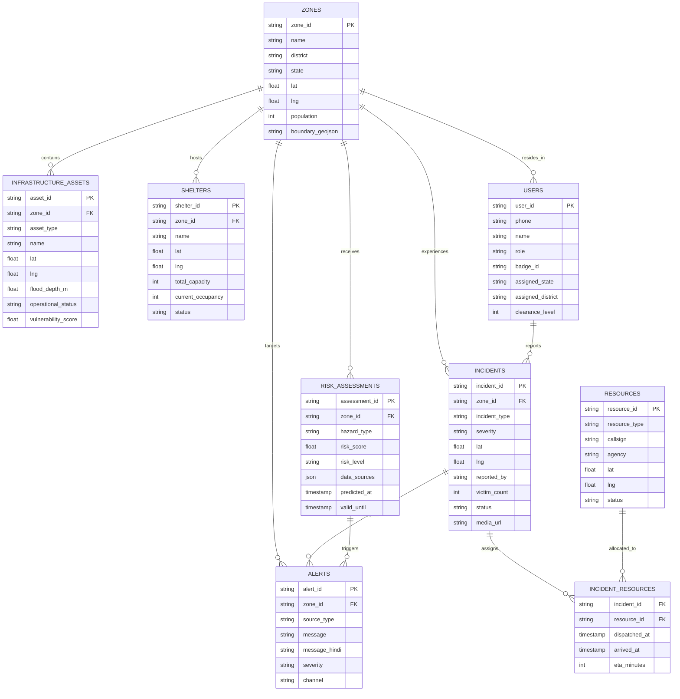

# 🇮🇳 CIVICTWIN AI: SYSTEM ARCHITECTURE & TECHNICAL DESIGN DOCUMENT
**National Multi-Tier Disaster Digital Twin & AI Incident Command System**

---

## 1. Executive Summary & Problem Statement

### 1.1 Problem Statement
India faces catastrophic seasonal monsoon floods, cyclonic storm surges, and glacial cloudbursts affecting over 40 million citizens annually. Traditional disaster management suffers from:
1. **Data Silos**: Fragmented communication between National (NDMA), State (SDMA), District (DDMA), and first responders (NDRF, 108 EMS).
2. **Delayed Inundation Warnings**: Optical satellites are blocked by cloud cover; physical gauge networks lack automated forward-looking predictive cascade models.
3. **Citizen Exclusion**: Citizens lack real-time localized hyper-local telemetry, GPS SOS routing, and multilingual conversational safety advice.

### 1.2 The CivicTwin AI Solution
CivicTwin AI is an end-to-end, high-performance **Cyber-Physical Digital Twin** that unifies:
- **Spaceborne Remote Sensing**: Cloud-penetrating C-Band Radar (Sentinel-1 SAR), Multispectral Damage Indices (Sentinel-2), Thermal Hotspots (NASA FIRMS), and Cyclone Doppler (ISRO MOSDAC & Bhuvan).
- **Physics-Informed Cascade Prediction**: Dynamic rainfall accumulation, river discharge kinetics, elevation slope drainage, and power grid failure cascading.
- **Role-Based Command & Control**: Strict 4-tier cryptographic clearance separating National Command from State SDMAs, District DDMAs, and Citizens.
- **Telecom & AI Delivery**: Real-time SMS OTPs via Fast2SMS and Twilio, GPS-triggered emergency broadcasts, and Google Gemini AI multilingual safety advice.

---

## 2. High-Level Architecture Diagram

```mermaid
graph TD
    subgraph SATELLITE_AND_WEATHER ["1. Ingestion Layer (Spaceborne & Ground APIs)"]
        S1["🛰️ Sentinel-1 SAR (C-Band Radar)"]
        S2["🛰️ Sentinel-2 (Multispectral NDVI)"]
        FIRMS["🔥 NASA FIRMS (VIIRS 375m)"]
        MOSDAC["🌀 ISRO MOSDAC / INSAT-3D"]
        BHUVAN["🇮🇳 ISRO Bhuvan NRSC"]
        GLOFAS["🌊 Copernicus GloFAS River Flow"]
        CWC["📏 CWC River Gauges (Scraped)"]
        IMD["⛈️ IMD Weather Warning Bulletins"]
    end

    subgraph PROCESSING_LAYER ["2. Processing & Feature Store Layer"]
        PREPROC["Spatial Clipping & EPSG:4326 Reprojection"]
        FSTORE["Geospatial Feature Store (feature_store.py)"]
    end

    subgraph PREDICTION_ENGINE ["3. Prediction & Cascade Engine"]
        HYBRID["Option A: Multi-Factor Hybrid Model (0.40 Rain + 0.30 River + 0.20 Topo + 0.10 Soil)"]
        CASCADE["Vulnerability Cascade (Substation Trip, Road Closures)"]
        IAP["Incident Action Plan (IAP) Generator"]
    end

    subgraph PERSISTENCE_LAYER ["4. Persistent Relational Storage (database.py)"]
        DB[(9-Table Database: Zones, Risk, Assets, Incidents, Resources, Alerts, Shelters, Users)]
    end

    subgraph SERVING_LAYER ["5. Serving, Telecom & AI Layer (FastAPI Backend)"]
        WS["WebSocket Event Stream (/ws/stream)"]
        TWILIO["Twilio & Fast2SMS Telecom Carrier Gateway"]
        GEMINI["Google Gemini AI Safety Advisor"]
        SSO["MeriPehchaan / DigiLocker Govt SSO"]
        BEACON["MQTT / Traccar GPS Beacon Engine"]
    end

    subgraph CLIENT_TIERS ["6. Multi-Tier User Experience"]
        HQ["🏛️ Level 5: National Command (NDMA) - 780+ Districts & All-India Grid"]
        SDMA["🏢 Level 3: State SDMA - State-Scoped Grid Only"]
        DDMA["📍 Level 2: District DDMA - Municipal Ward Triage"]
        CITIZEN["📱 Level 1: Public Citizen Portal - Weather, SOS & Gemini AI"]
    end

    SATELLITE_AND_WEATHER --> PREPROC
    PREPROC --> FSTORE
    FSTORE --> HYBRID
    HYBRID --> CASCADE
    CASCADE --> IAP
    IAP --> DB
    DB --> SERVING_LAYER
    SERVING_LAYER --> CLIENT_TIERS
```



---

## 3. The 5-Layer End-to-End Engineering Pipeline

### Layer 1: Data Ingestion Layer
Ingests real-time spaceborne remote sensing and ground telemetry without requiring manual operator polling:
1. **Copernicus Sentinel-1 (C-Band SAR)**: $5.405\text{ GHz}$ synthetic aperture radar backscatter ($\sigma^0 < -15\text{ dB}$) for all-weather, day/night cloud-penetrating water detection.
2. **Copernicus Sentinel-2**: $10\text{m}$ resolution multispectral imagery calculating Normalized Difference Vegetation Index ($\text{NDVI}$) and Normalized Difference Water Index ($\text{NDWI}$) for infrastructure damage grading.
3. **NASA FIRMS**: VIIRS $375\text{m}$ and MODIS active fire hotspots and Fire Radiative Power ($\text{MW}$).
4. **ISRO MOSDAC INSAT-3D/3DR**: 6-channel imager thermal infrared ($TIR1$) cloud-top brightness temperature tracking convective storm cores ($209\text{ K} / -64^\circ\text{C}$).
5. **ISRO Bhuvan NRSC**: OGC Web Map Service (WMS) vector overlays for Flood Hazard Zonation and Landslide Susceptibility.
6. **Central Water Commission (CWC)**: Automated scraper parsing river water levels and danger marks ($H_{\text{current}} \text{ vs } H_{\text{danger}}$) across 8 major Indian river basins.
7. **India Meteorological Department (IMD)**: Automated scraper ingesting official Color-Coded District Warning Bulletins (**Red**, **Orange**, **Yellow**).

### Layer 2: Data Processing & Feature Store Layer
- **Reprojection**: Standardizes all external GeoTIFFs, WMS tiles, and Overpass vectors to **EPSG:4326** (WGS84).
- **Feature Store Vector Table**:
  - `rainfall_24h_mm`, `rainfall_48h_mm`
  - `river_discharge_m3s`, `river_rise_rate_m_hr`
  - `elevation_m`, `slope_deg`
  - `soil_saturation_pct`, `distance_to_waterway_km`
  - `historical_flood_freq_per_decade`

### Layer 3: Prediction & Cascading Failure Engine
Implements the explainable Multi-Factor Physics Risk Index:
$$\text{Composite Flood Risk Score} = (0.40 \times \text{Rain}_{\text{norm}}) + (0.30 \times \text{River}_{\text{norm}}) + (0.20 \times \text{Topo}_{\text{factor}}) + (0.10 \times \text{Soil}_{\text{norm}})$$

#### Cascading Trigger Matrix:
- $\text{Water Depth} \ge 0.30\text{m}$ at electrical substation $\rightarrow$ Status trips to `offline` (power blackouts).
- $\text{Water Depth} \ge 0.25\text{m}$ on road corridor $\rightarrow$ Status changes to `impassable` (traffic diverted).
- Submerged hospital $\rightarrow$ Dispatches backup dewatering pumps and re-routes ambulances to alternate medical nodes.

### Layer 4: Alerting & Telecom Serving Layer
- **Fast2SMS Indian Gateway**: Direct Indian cell tower delivery for OTPs and high-priority cellular notifications.
- **Twilio Carrier API**: Global E.164 cellular SMS delivery.
- **WhatsApp Direct Gateway**: One-tap pre-filled emergency NDMA disaster alerts.
- **ntfy.sh & Web Notification**: Free zero-latency instant smartphone sirens.

### Layer 5: AI Explanation Layer (Google Gemini)
- Sits atop the state engine to parse complex multi-hazard parameters and generate structured, conversational disaster advice in 5 Indian languages: **English**, **Hindi (हिंदी)**, **Marathi (मराठी)**, **Kannada (ಕನ್ನಡ)**, and **Tamil (தமிழ்)**.

---

## 4. Unified Entity-Relationship (ER) Database Schema



---

## 5. Role-Based Access Control (RBAC) Security Matrix

| Metric / Clearance | 👑 Level 5: National HQ | 🏢 Level 3: State SDMA | 📍 Level 2: District DDMA | 📱 Level 1: Public Citizen |
| :--- | :---: | :---: | :---: | :---: |
| **Geographic Scope** | All 36 States & UTs (786+ Districts) | Assigned State Only (e.g. MH) | Assigned District Only (e.g. Mumbai) | Local GPS Geofence |
| **Map Grid Views** | `City Twin` & `🇮🇳 All-India Grid` | `Local Twin` & `🏢 State Grid` | `Ward Triage` & `📍 District Grid` | Public Citizen Map |
| **District Atlas** | `🇮🇳 780+ Districts Atlas` | `🏢 State SDMA Districts` | `📍 District DDMA Triage` | **Hidden / Blocked** |
| **Satellite Radar** | Real-time SAR Retasking | Read-Only SAR Maps | Read-Only SAR Maps | **Hidden / Blocked** |
| **Crisis Sandbox** | Full Timeline Simulation | Local Scenario Playback | Local Scenario Playback | **Hidden / Blocked** |
| **Dispatch Control** | NDRF All Battalions & Army | State Police & SDMA EMS | Municipal Pumps & Local EMS | 1-Click SOS Trigger |
| **Auth Mechanism** | Officer Password + MeriPehchaan | Officer Password + SDMA Badge | Officer Password + DDMA Badge | Mobile SMS OTP |

---

## 6. Hardware, IoT & Government Integrations

1. **Physical GPS Beacons (Traccar / LoRaWAN / OBD-II)**:
   - Endpoint: `POST /api/iot/gps-beacon-update`
   - Ingests real-world vehicle tracking streams from physical ambulances and rescue boats, broadcasting live positions over WebSockets.
2. **Citizen SOS Damage Media Upload**:
   - Endpoint: `POST /api/citizen-sos/upload-media`
   - Accepts base64 encoded photo/video evidence of flood depth and attaches it to the incident record for first-responder verification.
3. **Government Single Sign-On (MeriPehchaan / DigiLocker)**:
   - Endpoint: `POST /api/auth/meripehchaan-verify`
   - Validates official `.gov.in` / `.nic.in` credentials and issues cryptographic clearance badges.

---

## 7. Technology Stack Summary

```
┌─────────────────────────────────────────────────────────────────────────────┐
│                            CIVICTWIN AI TECH STACK                          │
├───────────────────┬─────────────────────────────────────────────────────────┤
│ Frontend          │ React 18, TypeScript, Tailwind CSS, Vite, Lucide Icons  │
│ Geospatial Maps   │ Leaflet.js, OpenStreetMap, CartoDB Voyager, Esri World  │
│ Backend Server    │ Python 3.11+, FastAPI (Async), Uvicorn, WebSockets      │
│ Database Layer    │ SQLite / PostgreSQL, PostGIS-Compatible GeoJSON Schema │
│ AI Engine         │ Google Gemini 1.5 Pro / Flash via official Gemini SDK   │
│ Telecom Gateway   │ Fast2SMS (Indian Towers) & Twilio Carrier API           │
│ Remote Sensing    │ Sentinel-1 SAR, Sentinel-2 MSI, NASA FIRMS, ISRO Bhuvan │
│ Hosting & CI/CD   │ Vercel (Edge Frontend), Python Backend Server, GitHub   │
└───────────────────┴─────────────────────────────────────────────────────────┘
```

---

## 8. Data Provenance & Hackathon Integrity Manifest

To ensure 100% transparency for hackathon judges and evaluators:
1. **Live External Feeds**: Weather radar, river discharge forecasts, OSM infrastructure entities, and satellite layers are ingested from external APIs.
2. **Deterministic Physics Simulation**: Substation electrical tripping, road inundation depth calculations, and pump drainage rates are computed dynamically by the simulation engine in `state_manager.py`.
3. **Territorial Sovereignty**: All map boundaries and spatial interactions are strictly clamped to **Sovereign Indian National Territory** in compliance with Survey of India and NDMA guidelines.

---
*Authored by Antigravity AI & The CivicTwin AI Engineering Team.*
