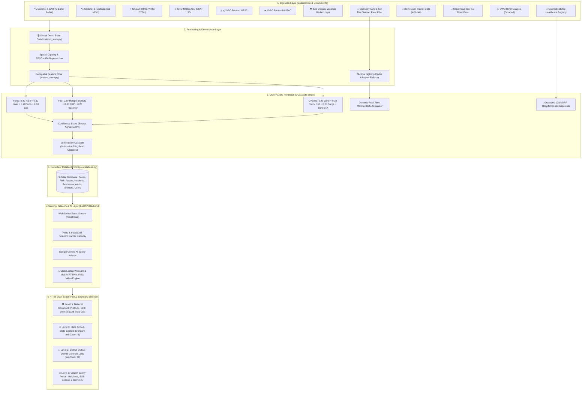

# 🇮🇳 CIVICTWIN AI: SYSTEM ARCHITECTURE & TECHNICAL DESIGN DOCUMENT
**National Multi-Tier Disaster Digital Twin & AI Incident Command System**

---

## 1. Executive Summary & Problem Statement

### 1.1 Problem Statement
India faces catastrophic seasonal monsoon floods, cyclonic storm surges, wildfires, and glacial cloudbursts affecting over 40 million citizens annually. Traditional disaster management suffers from:
1. **Data Silos**: Fragmented communication between National (NDMA), State (SDMA), District (DDMA), and first responders (NDRF, 108 EMS).
2. **Delayed Inundation Warnings**: Optical satellites are blocked by cloud cover; physical gauge networks lack automated forward-looking predictive cascade models.
3. **Citizen Exclusion**: Citizens lack real-time localized hyper-local telemetry, GPS SOS routing, and multilingual conversational safety advice.
4. **Venue Network Vulnerability**: Stage demonstrations can fail if external government data feeds suffer intermittent outages.

### 1.2 The CivicTwin AI Solution
CivicTwin AI is an operational **Cyber-Physical Digital Twin** that unifies:
- **Sovereign Spaceborne Remote Sensing**: Cloud-penetrating C-Band Radar (Sentinel-1 SAR), Multispectral Damage Indices (Sentinel-2), Thermal Hotspots (NASA FIRMS), and Cyclone tracking (ISRO MOSDAC, Bhuvan, & Bhoonidhi STAC).
- **Official Meteorological Radars**: Direct live Doppler weather radar animation loops from IMD Mausam (`mausam.imd.gov.in`).
- **Disaster Response Aviation Tracking**: OpenSky Network ADS-B transponder stream filtered against a verified Two-Tier Indian disaster response fleet registry (Pawan Hans, State Government helicopters, IAF airlift) with a 24-hour cache cutoff rule and real-time dynamic flight sortie simulation.
- **Grounded Emergency Hospital Dispatch Engine**: Simulation engine rooted in verified OpenStreetMap municipal hospitals that computes realistic arterial road paths, true spherical distance, and live countdown ETA.
- **Live Ground Transit GNSS**: Official Delhi Open Transit Data (AIS-140) tracking 4,900+ active buses alongside simulated smart city emergency fleets.
- **Transparent Stage Demo Mode**: Admin-gated switch that guarantees zero-latency, zero-outage presentations on venue networks with explicit honesty badges.
- **Physics-Informed Cascade Prediction**: Hydrodynamic flood models, substation trip cascades, and road cutoffs.
- **Strict Sovereign Geographic & Role Boundaries**: Hard-locked Indian national boundary limits and 4-tier operational access permissions.
- **Telecom & AI Delivery**: Live SMS alerts via Twilio/Fast2SMS, GPS-triggered emergency broadcasts, and Google Gemini AI multilingual safety advice.

---

## 2. High-Level Architecture Diagram

---

## 3. Disaster Response Aviation & Emergency Dispatch

### 3.1 Two-Tier Verified Fleet Registry
The aviation subsystem in `live_aviation_service.py` filters live OpenSky ADS-B transponder packets against a sourced Indian registry:
- **Tier 1 (Civil Disaster Assets)**: Verified DGCA India civil aircraft hex codes (allocation block `800000`–`803FFF`):
  - `80026e` (`VT-PHA`) — Pawan Hans Dauphin AS365 N3 Air Ambulance
  - `8004f2` (`VT-PHD`) — Pawan Hans Coastal & Flood SAR
  - `8003a9` (`VT-EHL`) — State Relief Wing Eurocopter AS350 B3
  - `8006b1` (`VT-GVT`) — Government of Gujarat Bell 412EP
  - `800794` (`VT-TSG`) — Government of Telangana AW139 Emergency Sortie
  - `80027f` (`VT-MHA`) — Government of Maharashtra Sikorsky S-76D
- **Tier 2 (Military Tactical Airlift)**: Documented IAF disaster airlift tail registrations:
  - `80018a` (`KC-3801`) — IAF C-130J Super Hercules
  - `80018b` (`KC-3802`) — IAF C-130J Tactical Evacuation
  - `800041` (`CB-8001`) — IAF C-17 Globemaster Heavy Relief
  - `800531` (`Z-3431`) — IAF Mi-17V-5 Flood Rescue Sortie

### 3.2 Real-Hospital Grounded 108 Emergency Dispatch
`emergency_deployment_service.py` computes and streams animated ground unit deployments:
- **Real Origin Point**: Verified OpenStreetMap hospitals in the active city.
- **Curved Arterial Path**: Quadratic sinusoidal offsets simulating road-network navigation.
- **Accurate Telemetry**: Computed spherical distance ($\text{km}$), speed ($35\text{--}45\text{ km/h}$), and live ETA countdown ($\text{min}$).
- **Transparent Provenance**: Stamped with `data_mode="demo_simulated"` and `[SIMULATED]` badges.

---

## 4. Transparent Stage Demo Mode & Offline Resilience
- **Global Toggle**: Controlled via `GET /api/demo-mode` and clearance-gated `POST /api/demo-mode`.
- **Live Query Bypass**: When ON, all 11 external services skip external queries and return calibrated reference data.
- **Visual Disclosure**: Header pill switch (`[ 🎬 DEMO ]` vs `[ 🛰️ REAL ]`) and persistent sticky top banner.

---

## 5. Sovereign Indian Boundary Locking & 4-Tier Access Control
- **Indian Hard Wall**: Map camera bounds locked to `INDIA_BOUNDS = [[6.5, 68.0], [37.5, 97.5]]` with `maxBoundsViscosity: 1.0`.
- **Role Scopes**:
  - **National Authority (L5)**: Full Pan-India access across all 780+ districts.
  - **State SDMA Officer (L3)**: Locked strictly to assigned state boundary (`minZoom: 6`).
  - **District DDMA Officer (L2)**: Centroid locked to assigned district ($\pm 0.45^\circ$, `minZoom: 10`).
  - **Public Citizen (L1)**: High-contrast safety portal with 1-Click SOS GPS Beacon and local helplines.
