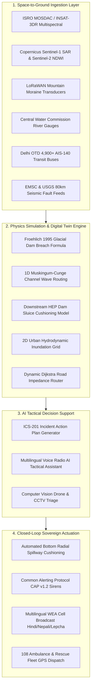

# 🏛️ CIVICTWIN AI — COMPLETE ARCHITECTURE & OPERATIONAL WORKFLOW GUIDE

A comprehensive technical manual and operational briefing detailing the end-to-end cyber-physical workflow of the **CivicTwin AI** platform for Smart India Hackathon (SIH 2026) and sovereign disaster management authorities (NDMA/SDMA).

---

## 1. 🔄 Executive End-to-End System Workflow

---

## 2. 🌊 Glacial Lake Outburst Flood (GLOF) & Dam Cushioning Workflow

1. **Spaceborne Anomaly Trigger**:
   - Sentinel-2 MSI acquisition passes every 5 days; computes float32 NDWI:
     $$\text{NDWI} = \frac{\text{B03 (Green)} - \text{B08 (NIR)}}{\text{B03} + \text{B08}}$$
   - Detects rapid glacial lake water surface expansion exceeding $+15\%$.
2. **Ground LoRaWAN Cross-Verification**:
   - High-altitude piezometric pressure transducers on the moraine dam measure water elevation rise ($>1.5\text{ cm/hr}$).
   - Sub-surface inclinometers detect moraine creep drift ($>4.0\text{ mm}$).
3. **Hydrodynamic Dam Breach Calculation**:
   - Froehlich (1995) formula computes peak discharge with $35\%$ debris/boulder bulking:
     $$Q_p = 0.607 \cdot V_w^{0.295} \cdot H_w^{1.24} \cdot \text{ErosionRate} \cdot (1 + \text{CloudburstSurcharge})$$
4. **1D Muskingum-Cunge Downstream Channel Wave Routing**:
   - Computes wave celerity ($c = \frac{5}{3}v \approx 45\text{ km/h}$) and arrival ETA for every downstream settlement.
5. **Hydroelectric Dam Sluice Gate Automation**:
   - Generates emergency order to open bottom radial spillways on downstream dams (e.g., Teesta-III Chungthang), dumping baseline water to create an empty $15\text{M m}^3$ cushion.
   - Dampens incoming peak surge depth by **$65\%$** (from $14.2\text{m} \to 4.2\text{m}$), preventing dam overtopping.

---

## 3. 🚨 Citizen SOS, Geocoding & Emergency Dispatch Workflow

1. **Citizen SOS Trigger**:
   - A trapped citizen submits an SOS via the web portal, WhatsApp disaster bot, or single-tap GPS SOS button.
   - Captures high-accuracy WGS-84 coordinates, severity level, flood depth at location, and optional medical distress flags.
2. **Reverse Geocoding & POI Cross-Referencing**:
   - The platform maps the incident to the nearest landmark using OpenStreetMap Overpass and municipal hospital/shelter directories.
3. **Dynamic Routing with Road Closures**:
   - Dijkstra router dynamically calculates impedances, routing 108 ambulances and NDRF rafts only along submerged-free roads ($<0.3\text{m}$ flood depth).
4. **Provenance Ledger Inscription**:
   - All dispatches and status transitions are immutably signed with SHA-256 cryptographic hashes for complete transparency.

---

## 4. 📢 Multilingual CAP v1.2 Emergency Siren Broadcasting

1. **OASIS / ITU-T X.1303 Alert Construction**:
   - The platform packages incident severity, headline, urgency, certainty, and geographical polygon bounds.
2. **Multilingual Synthesis**:
   - Generates coordinated alert feeds in **English, Hindi (हिंदी), Nepali (नेपाली), and Lepcha**.
3. **High-Decibel Siren Distribution**:
   - Transmits digital trigger to high-decibel mountain sirens and Wireless Emergency Alerts (WEA) directing citizens to vertical evacuation safe zones **$>35\text{m}$ vertical elevation above the riverbed**.

---

## 5. 🗄️ Neon Cloud PostgreSQL Database Architecture

The system utilizes 9 relational tables hosted on **Neon Serverless PostgreSQL (pgVersion 18)**:
* `zones`: Administrative wards and mountain valley districts.
* `risk_assessments`: Composite multi-hazard risk scores ($0\text{--}100$).
* `infrastructure_assets`: Hospitals, power substations, bridges, dams, shelters.
* `incidents`: Real-time citizen SOS reports and field alerts.
* `resources`: Police, 108 ambulances, NDRF rescue boats, drone units.
* `incident_resources`: Dynamic dispatch junction mappings.
* `alerts`: Common Alerting Protocol (CAP v1.2) emergency broadcasts.
* `shelters`: Relief camps, current occupancy, generator and rations status.
* `state_snapshots`: Complete point-in-time cyber-physical digital twin snapshots.
