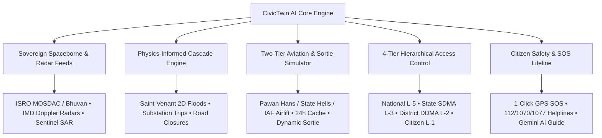

# 🏛️ CIVICTWIN AI — PROJECT OVERVIEW
**India's Operational Multi-Hazard Disaster Response & Civil Defense Digital Twin**

---

## 1. Executive Summary

**CivicTwin AI** is an advanced, production-grade cyber-physical digital twin engineered to predict, simulate, and coordinate multi-hazard disaster response and civil defense operations across all **780+ Indian districts** and **36 States/Union Territories**.

By fusing spaceborne earth observation (ISRO MOSDAC, ISRO Bhuvan, Copernicus Sentinel-1/2 SAR, NASA FIRMS), official real-time meteorological Doppler radars (IMD Mausam), 2D hydrodynamic physics engines, live aviation ADS-B transponder filtering (OpenSky Network), zero-latency hardware computer vision (webcams and mobile cameras), and Google Gemini AI, CivicTwin AI bridges the critical operational gap between **National Command (NDMA)**, **State Authorities (SDMA)**, **District Collectors (DDMA)**, and **Vulnerable Citizens**.

---

## 2. Core Capabilities & Architectural Highlights



### 🛰️ 1. Multi-Satellite & Radar Remote Sensing Hub
- **ISRO MOSDAC (SAC Ahmedabad)**: Ingests INSAT-3D/3DR geostationary thermal infrared brightness temperatures ($209\,\text{K} / -64^\circ\text{C}$) and Hydro-Estimator real-time rainfall precipitation rates (`3SIMG_L2B_HEM`).
- **ISRO Bhuvan (NRSC Hyderabad)**: OGC WMS vector overlays, hospital POIs, village geocoding directories, and CartoDEM terrain models.
- **IMD Mausam Doppler Weather Radars**: Real-time live animated radar loops (`MUM_MAXZ.gif`, `DLH_MAXZ.gif`, `HYD_MAXZ.gif`, and National `mosaic.gif`) streaming cloud reflectivity and storm motion into both Single Focus and Matrix (4x4) views.
- **Copernicus Sentinel-1 SAR & Sentinel-2 Optical**: Cloud-penetrating C-Band radar backscatter ($\sigma^0 < -16\,\text{dB}$) for night/storm water extraction and $10\text{m}$ multispectral NDWI/NDVI vegetation and asset damage grading.
- **NASA FIRMS (VIIRS 375m & MODIS)**: Thermal active hotspots and Fire Radiative Power ($\text{MW}$).

### ✈️ 2. Two-Tier Disaster Response Aviation & Sortie Simulator
- **Verified Sourced ICAO24 Fleet Registry**:
  - **Tier 1 (Civil Disaster Assets)**: Verified DGCA India civil aircraft hex codes (Pawan Hans Dauphin AS365 `VT-PHA`/`VT-PHD`, Maharashtra S-76 `VT-MHA`, Gujarat Bell 412 `VT-GVT`, Telangana AW139 `VT-TSG`, State Eurocopter `VT-EHL`).
  - **Tier 2 (Military Tactical Airlift)**: Documented IAF C-130J Super Hercules (`KC-3801`/`KC-3802`), C-17 Globemaster III (`CB-8001`), and Mi-17V-5 (`Z-3431`) rescue units.
- **24-Hour Cache Lifecycle Policy**: Enforces a strict 24-hour cutoff rule for cached sightings (`🟡 LAST RECORDED (At HH:MM IST)`), purging stale records.
- **Dynamic Real-Time Sortie Flight Simulator**: Dedicated **`🚁 Launch Demo NDRF Sortie`** tool that injects an animated helicopter flight loop across 12 mission waypoints (Takeoff $\rightarrow$ Flood Scanning $\rightarrow$ Airdrop 400 ration packs $\rightarrow$ Winch hoist $\rightarrow$ Base return) with transparent `[SIMULATED]` labeling.

### 🗺️ 3. Sovereign Indian Boundary Limits & 4-Tier Access Control
- **Strict Indian Hard Wall**: Map camera bounds locked to `INDIA_BOUNDS = [[6.5, 68.0], [37.5, 97.5]]` with `maxBoundsViscosity: 1.0`. Dragging or panning outside Indian national borders is forbidden.
- **Hierarchical Clearance Model**:
  - **👑 National Authority (Level 5)**: Full Pan-India command, all 28 states & 8 UTs, national Doppler radar grid, inter-state tactical dispatch.
  - **🏢 State SDMA Officer (Level 3)**: Locked strictly to assigned state boundary (`minZoom: 6`), managing all districts within that state. Clicks outside state trigger access restriction alerts.
  - **📍 District DDMA Officer (Level 2)**: Locked strictly to assigned district centroid ($\pm 0.45^\circ$, `minZoom: 10`), municipal ward triage, local subways, and relief camps.
  - **👥 Public Citizen (Level 1)**: Dedicated Citizen Safety Portal with local emergency helplines (112, 1070, 1077, 108), 1-Click SOS GPS Beacon, Gemini AI safety guide, and safe shelters list.

### 📹 4. Tactical CCTV Matrix & 1-Click Laptop Webcam Ingestion
- **1-Click Laptop Webcam**: Direct zero-latency hardware ingestion via `navigator.mediaDevices.getUserMedia()`, overlaying real-time YOLO computer vision detections, bounding boxes, and FLIR thermal color palettes.
- **Direct IP / Mobile Cameras**: Ingestion of smartphone RTSP/MJPEG feeds (`http://<PHONE_IP>:8080/video`) for rapid field deployment.

---

## 3. Technology Stack

| Layer | Technologies |
| :--- | :--- |
| **Frontend** | React 18, TypeScript, Vite, Tailwind CSS, Leaflet GIS, Lucide Icons, KaTeX Math |
| **Backend** | Python 3.11, FastAPI, Uvicorn, Pydantic v2, WebSockets, AsyncIO, SQLite/PostgreSQL |
| **AI & LLM** | Google Gemini 1.5 Flash/Pro, Prompt Engineering for Incident Command Systems (ICS-201) |
| **Computer Vision** | YOLOv8 Object Detection, FLIR Thermal Shader Simulation, Night Vision Matrix |
| **Data Ingestion** | OpenSky Network ADS-B, IMD Mausam, ISRO MOSDAC/Bhuvan, Open-Meteo, GloFAS, USGS, TomTom, AISStream |
| **Telecom** | Twilio Carrier Gateway, Fast2SMS, Common Alerting Protocol (CAP v1.2) |

---

## 4. Operational Deployment

### Prerequisites
- Python 3.10+
- Node.js 18+ and npm

### 1-Click Startup
Double-click `run_civictwin.bat` in the repository root.

### Manual Startup
```bash
# Terminal 1: Backend
cd backend
python -m pip install -r requirements.txt
python -m uvicorn app.main:app --reload --host 127.0.0.1 --port 8000

# Terminal 2: Frontend
cd frontend
npm install
npm run dev
```

Access the platform at **`http://localhost:5173`**.
