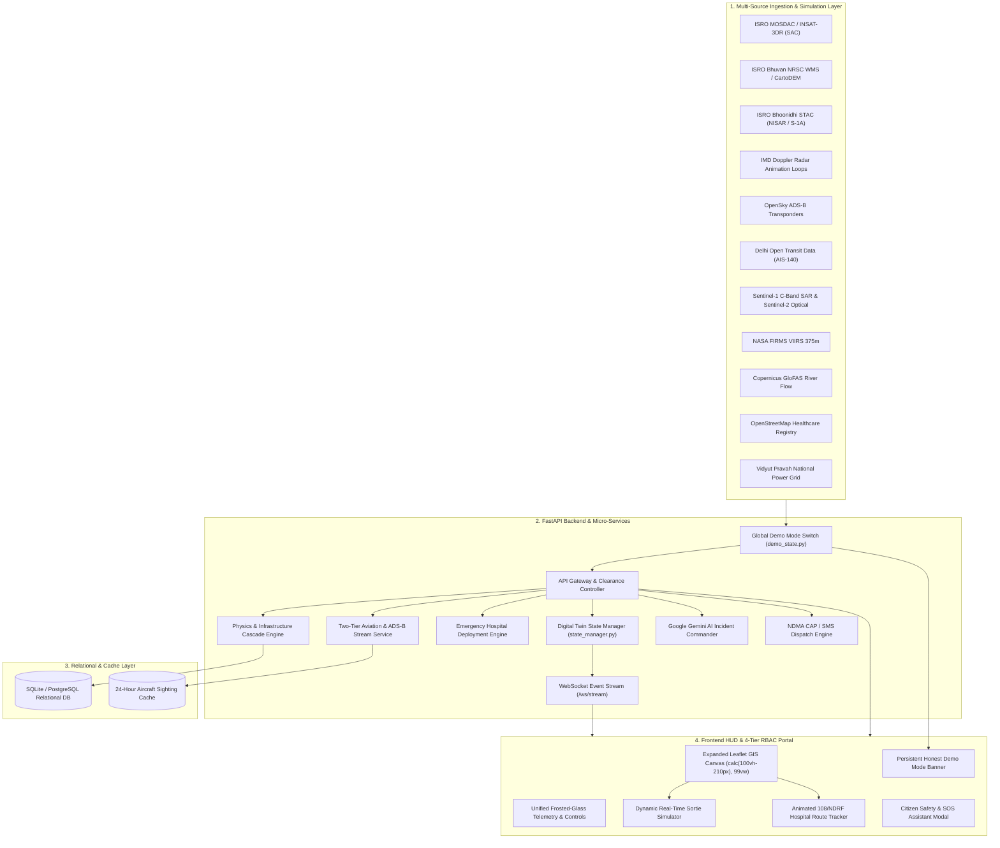

# 📐 CIVICTWIN AI — SYSTEM DESIGN DOCUMENT
**Technical Architecture, Micro-Services & Component Design Specification**

---

## 1. System Architecture & Topology



---

## 2. Component Design & Microservices

### 2.1 Transparent Stage Demo Mode Engine (`demo_state.py`)
- **Architecture**: A singleton class managing global execution mode across all backend services:
  ```python
  class DemoState:
      _demo_mode: bool = False

      @classmethod
      def is_on(cls) -> bool:
          return cls._demo_mode

      @classmethod
      def set(cls, value: bool):
          cls._demo_mode = value

  demo_state = DemoState()
  ```
- **Service Instrumentation**: When `demo_state.is_on()` is true, all live external services skip external HTTP calls and immediately return calibrated reference data with `data_mode="demo_simulated"`.
- **API Endpoints**:
  - `GET /api/demo-mode` $\rightarrow$ Public read of current presentation mode.
  - `POST /api/demo-mode` $\rightarrow$ Clearance-gated toggle for admin presentation control.

---

### 2.2 Grounded Emergency Response Deployment Engine (`emergency_deployment_service.py`)
- **Functionality**: Generates realistic, animated emergency dispatches connecting verified OpenStreetMap hospitals to active disaster inundation zones.
- **Route Interpolation & Kinematics**:
  ```python
  def generate_deployment(origin_lat, origin_lng, dest_lat, dest_lng, unit_type="AMB", steps=50):
      route = []
      for i in range(steps + 1):
          t = i / steps
          curve_offset = math.sin(t * math.pi) * 0.005
          lat = origin_lat + (dest_lat - origin_lat) * t + curve_offset
          lng = origin_lng + (dest_lng - origin_lng) * t - (curve_offset * 0.5)
          route.append({"lat": round(lat, 5), "lng": round(lng, 5), "step": i})
      
      distance_km = round(math.sqrt((dest_lat - origin_lat)**2 + (dest_lng - origin_lng)**2) * 111.0, 2)
      eta_min = round(max(1.0, (distance_km / unit["speed_kmh"]) * 60.0), 1)
      return { ... }
  ```
- **API Endpoint**: `POST /api/simulate/emergency-deployment`

---

### 2.3 Two-Tier Aviation Filter & ADS-B Stream (`live_aviation_service.py`)
- **Ingestion**: Polls OpenSky Network `/api/states/all` over Indian airspace ($1.8^\circ$ radius).
- **Matching Algorithm**:
  ```python
  def filter_aircraft(raw_states, registry, cache):
      for state in raw_states:
          icao = state[0].lower().strip()
          if icao in registry:
              tag_disaster_response(state, registry[icao], status="LIVE_ADSB")
              cache.update(icao, timestamp=now)
          elif matches_callsign_prefix(state[1], ["IAF", "NDRF", "SDRF", "PAWAN"]):
              tag_disaster_response(state, generic_profile, status="LIVE_ADSB")
  ```
- **Frontend Layer Stacking**: Markers rendered with `zIndexOffset: 8500` ensuring zero visual occlusion beneath flood polygons or WMS raster tiles.
- **Polling Interval**: Automated continuous 6-second polling loop.

---

### 2.4 Ground Transit Telemetry (`live_delhi_otd_service.py` & `live_state_vehicle_service.py`)
- **Live Delhi OTD Feed**: Ingests official binary GTFS-Realtime Protocol Buffers from `otd.delhi.gov.in/api/realtime/VehiclePositions.pb`, parsing over 4,900 live GPS vehicles.
- **Simulated Smart City Fleets**: Generates kinematically moving emergency units across major cities (Mumbai, Bengaluru, Chennai, Kochi, Hyderabad) with `[SIM]` tags and realistic arterial corridors ($0.075^\circ$–$0.085^\circ$).

---

### 2.5 Map Viewport & Layer Hierarchy (`DigitalTwinMap.tsx`)

| Layer / Element | Z-Index Offset | Visual Treatment |
| :--- | :--- | :--- |
| **Base Satellite/Road Tiles** | Base ($0$) | Google Satellite, Roads, Terrain, Dark, Bhuvan |
| **Bhuvan / Sentinel WMS Overlays** | $1000$ | Inundation Rasters & LULC Classifications |
| **Flood Inundation Polygons** | $2000$ | Semi-transparent Depth Contours ($0.1\text{--}2.5\text{m}$) |
| **Critical Infrastructure Nodes** | $3000$ | Substations, Water Pumps, Bridges, Hospitals |
| **OpenStreetMap Live Hospitals** | $5000$ | Glowing 32px Hospital Pins with Dispatch Buttons |
| **Ground Transit & Smart City Vehicles** | $6000$ | Compact Icon Pins with Hover-Revealed ID Tags |
| **Live OpenSky Aircraft & Sorties** | $8500$ | Glowing 32px Transponder Pins with Active Headings |
| **108 Emergency Route & Target** | $12000\text{--}16000$ | Glowing Red Dashed Polyline & Moving Ambulance |

---

## 3. Physics-Informed Cascade Engine Equations

### 3.1 Saint-Venant 2D Inundation Kinematics
Water surface elevation and depth propagation computed via 2D shallow water conservation:
$$\frac{\partial h}{\partial t} + \frac{\partial (h u)}{\partial x} + \frac{\partial (h v)}{\partial y} = R_{\text{intensity}} - I_{\text{soil}}$$

Where:
- $h$: Water depth ($m$)
- $u, v$: Velocity vector components ($m/s$)
- $R_{\text{intensity}}$: Rainfall rate from IMD/MOSDAC ($m/s$)
- $I_{\text{soil}}$: Infiltration capacity rate ($m/s$)

### 3.2 Electrical Substation Trip Cascade Trigger
A power node trips when local inundation exceeds critical bund height:
$$\text{TripCondition}(Node_i) = \begin{cases} \text{TRIPPED} & \text{if } h_i \ge H_{\text{bund}} \ (0.45\,\text{m}) \\ \text{OPERATIONAL} & \text{otherwise} \end{cases}$$
