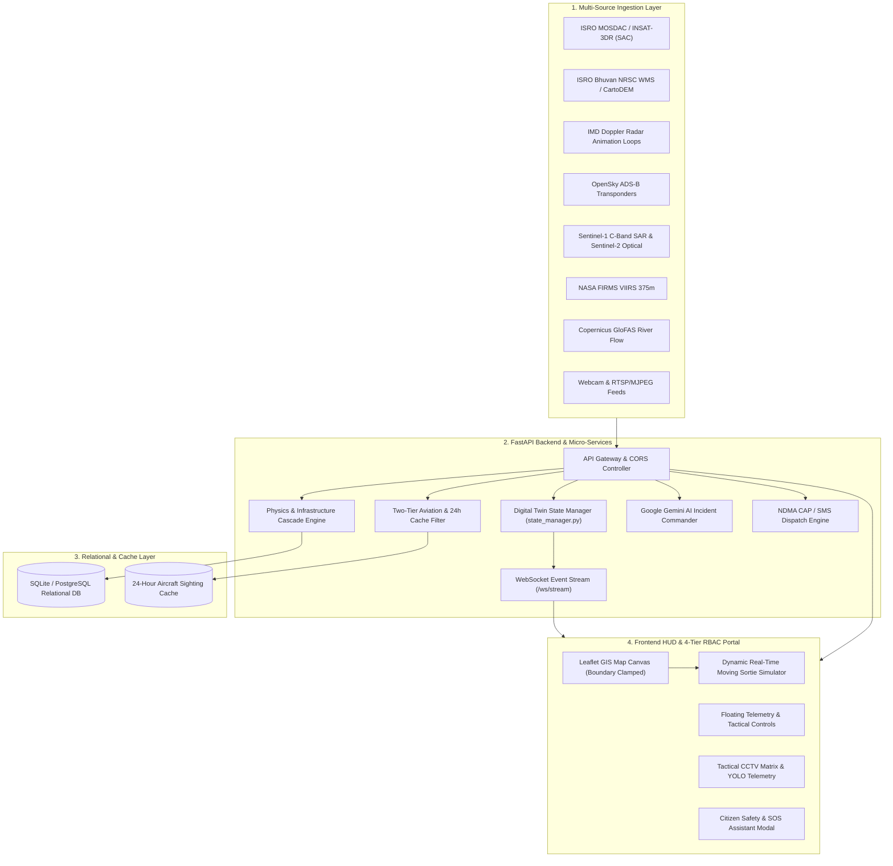

# 📐 CIVICTWIN AI — SYSTEM DESIGN DOCUMENT
**Technical Architecture, Micro-Services & Component Design Specification**

---

## 1. System Architecture & Topology



---

## 2. Component Design & Subsystems

### 2.1 Aviation Filter & Two-Tier Aircraft Registry (`live_aviation_service.py`)
- **Ingestion**: Polls OpenSky Network `/api/states/all` over the city's bounding box ($1.2^\circ$ radius).
- **Matching Algorithm**:
  ```python
  def filter_aircraft(raw_states, registry, cache):
      for state in raw_states:
          icao = state[0].lower().strip()
          if icao in registry:
              tag_disaster_response(state, registry[icao], status="LIVE_ADSB")
              cache.update(icao, timestamp=now)
          elif matches_callsign_prefix(state[1], ["IAF", "NDRF", "SDRF", "PAWAN"]):
              tag_disaster_response(state, generic_profile, status="LIVE_ADSB")
  ```
- **24-Hour Cache Lifecycle**:
  Sightings are stored with UTC timestamp. Any record where $(\text{now} - \text{recorded\_at}) > 86,400\,\text{s}$ is automatically purged.

---

### 2.2 Sovereign Indian Map Boundary Enforcer (`DigitalTwinMap.tsx`)
- Hard constraints applied during Leaflet map initialization:
  ```typescript
  const INDIA_BOUNDS = L.latLngBounds(L.latLng(6.5, 68.0), L.latLng(37.5, 97.5));

  const map = L.map(container, {
    maxBounds: INDIA_BOUNDS,
    maxBoundsViscosity: 1.0,
    minZoom: 4,
    maxZoom: 20
  });
  ```
- Dynamic role-based clamping:
  - **State Officer**: `map.setMaxBounds(stateBounds); map.setMinZoom(6);`
  - **District Officer**: `map.setMaxBounds(districtBounds); map.setMinZoom(10);`

---

### 2.3 Physics-Informed 2D Inundation & Cascade Engine
- **Peak Discharge**:
  $$Q_{\text{peak}} = \frac{1}{360} \cdot C \cdot I \cdot A$$
  where $C$ is the composite runoff coefficient ($0.78$ for dense urban areas), $I$ is precipitation intensity in $\text{mm/h}$, and $A$ is catchment area in hectares.
- **Inundation Depth**:
  $$h(x, y, t) = h_0 + \int (R - I_{\text{infil}} - Q_{\text{drain}}) \, dt$$
- **Infrastructure Cascade Matrix**:
  - Substation trip occurs when $h > 0.45\,\text{m}$.
  - Secondary water pump failure triggered upon substation de-energization.
  - Hospital ICU emergency generator runtime evaluated against fuel tank depletion curve.

---

### 2.4 Dynamic Moving Sortie Flight Simulator
- Waypoint interpolation equation:
  $$P(t) = (1 - \alpha) \cdot W_k + \alpha \cdot W_{k+1}, \quad \alpha = \frac{t \bmod \Delta t}{\Delta t}$$
- Smoothly advances heading angle $\theta$, altitude $z(t)$, and airspeed $v(t)$ across 12 distinct mission phases with real-time popup telemetry.

---

## 3. Data Schema & Persistence

### 3.1 Digital Twin State Schema (`schemas.py`)
```json
{
  "city_id": "mumbai_monsoon",
  "city_name": "Mumbai",
  "center_coords": [19.076, 72.877],
  "timeline_hour": 3.5,
  "rain_intensity_mmhr": 48.5,
  "storm_surge_m": 0.85,
  "flood_depth_avg_m": 0.62,
  "inundated_area_km2": 14.8,
  "nodes": [...],
  "sensors": [...],
  "roads": [...],
  "evacuation_routes": [...],
  "dispatch_units": [...],
  "iap": {
    "overall_threat_level": "CRITICAL",
    "priority_actions": [...]
  }
}
```

---

## 4. Security & Compliance
- **Authentication**: JWT clearance tokens with role scopes (`national_authority`, `state_officer`, `district_officer`, `citizen`).
- **Standardization**: Full adherence to NDMA Common Alerting Protocol (CAP v1.2) and WMS/WFS open geospatial standards.
- **Encryption**: TLS 1.3 / HTTPS for API traffic and AES-256 for database storage.
